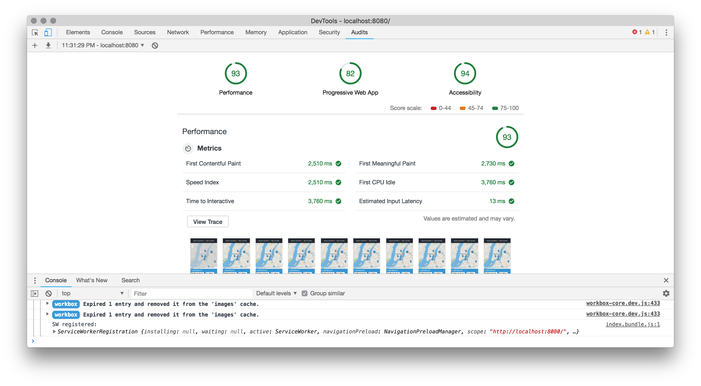

# mws-restaurant-stage-2-client


## Server API
 1. Clone the [server repository](https://github.com/udacity/mws-restaurant-stage-2.git). You’ll use this development server to develop your project code.
 2. Install project dependancies
    ```
    npm i
    ```
 3. Install Sails.js globally
    ```
    npm i sails -g
    ```
 4. Start the server
    ```
    node server
    ```

## Client Application
 1. Clone the [client repository](https://github.com/jenlyoung/mws-restaurant-stage-2-client.git)
 2. Install project dependencies
     ```
     npm i
     ```
 3. Run the npm script that launches the local http-server
     ```
     npm run audit
     ```
 4. Open web browser to http://localhost:8080


## Performance

 